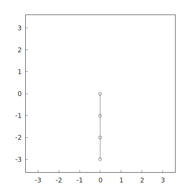

# Pendulum

Pendulum balanced by a receeding horizon model predictive controller.



## Build and run

Inside the devcontainer:

```bash
cmake -B build --preset vcpkg
cmake --build build
./build/pendulum
```

Pressing number keys in the terminal will switch the reference angle of a joint between $0$ and $\pi$. Pressing <kbd>1</kbd> will switch the reference angle of the first joint, <kbd>2</kbd> the angle of the second and so on.